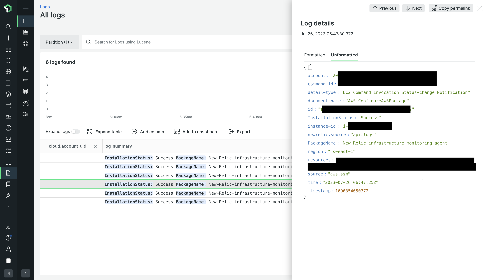
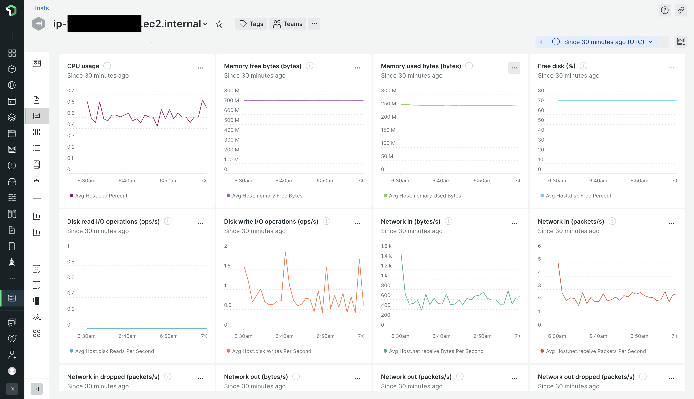

After successfully deplopying this template user will be able to monitor ec2 instances present across multiple regions and AWS Accounts in New Relic. It automates the installation of New Relic Infrastructure Agent in exisiting(before installation of this solution) and new ec2 instances(any instance spinned post installation of this solution). 

**NewRelic Infrastructure Agent installation Logs**

**EC2 Metrics Dashboard in NewRelic**

